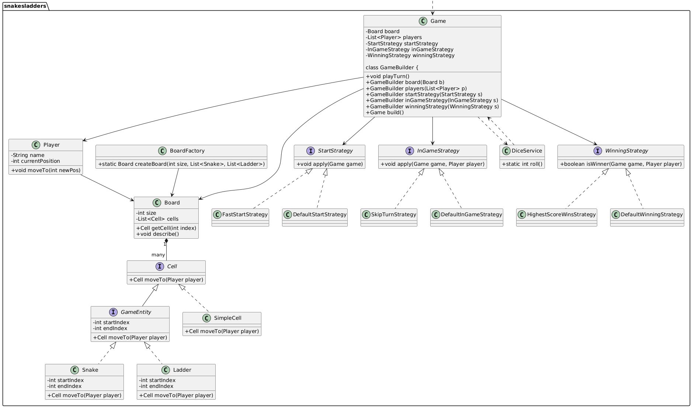

## Parking Lot System - Detailed Use Case

### Problem Statement

Design a parking lot system that can handle different types of vehicles and provide efficient parking allocation and management.

### Requirements

#### Functional Requirements

1. **Vehicle Management**

   - Support different vehicle types (Motorcycle, Car, Bus/Truck)
   - Each vehicle has a unique license plate
   - Vehicles have different sizes requiring different parking spots

2. **Parking Spot Management**

   - Different spot sizes: Compact, Regular, Large
   - Each spot has a unique identifier and size type
   - Track spot availability in real-time

3. **Parking Operations**

   - Park a vehicle in an appropriate spot
   - Retrieve/Remove a vehicle from parking
   - Calculate parking fees based on duration and vehicle type

4. **Payment System**
   - Multiple payment methods (Cash, Credit Card, Mobile Payment)
   - Generate parking tickets with entry/exit timestamps
   - Apply different pricing strategies

#### Non-Functional Requirements

- System should handle high concurrency (multiple vehicles entering/exiting simultaneously)
- Fast spot allocation (< 100ms response time)
- 99.9% system availability
- Scalable to handle 1000+ parking spots

### Key Components

#### 1. Vehicle Hierarchy

```text
Vehicle (Abstract)
├── Motorcycle (Size: 1 spot)
├── Car (Size: 1 spot)
└── Bus/Truck (Size: 2-3 spots)
```

#### 2. Parking Spot Types

- **Compact Spots**: For motorcycles and small cars
- **Regular Spots**: For standard cars
- **Large Spots**: For buses and trucks

#### 3. Core Classes Design

##### Vehicle Management

- `Vehicle` (abstract base class)
- `Motorcycle`, `Car`, `Bus` (concrete implementations)
- `VehicleType` enum

##### Parking Infrastructure

- `ParkingSpot` (with size, availability, vehicle reference)
- `ParkingLevel` (collection of spots)
- `ParkingLot` (collection of levels)

##### Booking & Payment

- `ParkingTicket` (entry time, spot assignment, vehicle info)
- `PaymentProcessor` (handles different payment methods)
- `PricingStrategy` (hourly rates, vehicle-specific pricing)

#### 4. Design Patterns Used

##### Strategy Pattern

- Different parking allocation strategies (nearest, cheapest, premium)
- Multiple pricing strategies
- Various payment processing methods

##### Factory Pattern

- Vehicle creation based on type
- Parking spot allocation based on vehicle requirements

##### Observer Pattern

- Notify when spots become available
- Real-time capacity updates

##### Singleton Pattern

- Parking lot management instance
- Configuration management

### Use Case Scenarios

#### Scenario 1: Car Parking

1. Car arrives at parking lot entrance
2. System checks for available regular/compact spots
3. Allocate nearest available spot
4. Generate parking ticket with entry timestamp
5. Vehicle parks in assigned spot
6. Update spot availability in real-time

#### Scenario 2: Vehicle Retrieval

1. Customer presents parking ticket
2. System calculates parking duration
3. Apply pricing strategy to determine fee
4. Process payment through selected method
5. Mark parking spot as available
6. Update system capacity

#### Scenario 3: Bus Parking

1. Bus arrives requiring large spot
2. System checks for large spot availability
3. If no large spots, check if multiple regular spots are adjacent
4. Allocate appropriate space
5. Handle special pricing for oversized vehicles

#### Scenario 4: Peak Hour Management

1. Implement dynamic pricing during peak hours
2. Reserve spots for premium customers
3. Queue management when lot is full
4. Notify when spots become available

### Advanced Features

#### 1. Reservation System

- Pre-book parking spots
- VIP/Premium customer handling
- Time-bound reservations

#### 2. Analytics & Reporting

- Peak usage time analysis
- Revenue tracking
- Spot utilization metrics
- Customer behavior patterns

#### 3. Integration Capabilities

- Mobile app integration
- RFID/License plate recognition
- Third-party payment gateways
- Navigation system integration

### Error Handling

1. **No Available Spots**: Queue vehicle or suggest alternative locations
2. **Invalid Ticket**: Verify ticket authenticity and handle disputes
3. **Payment Failures**: Provide alternative payment options
4. **System Downtime**: Maintain basic functionality with backup systems

### Scalability Considerations

1. **Horizontal Scaling**: Distribute across multiple parking levels/locations
2. **Database Optimization**: Efficient indexing for quick spot searches
3. **Caching**: Cache frequently accessed spot availability data
4. **Load Balancing**: Handle multiple entry/exit points simultaneously

This parking lot system demonstrates key object-oriented design principles similar to the Snake and Ladder game, including proper abstraction, encapsulation, and the use of design patterns for extensible and maintainable code.
